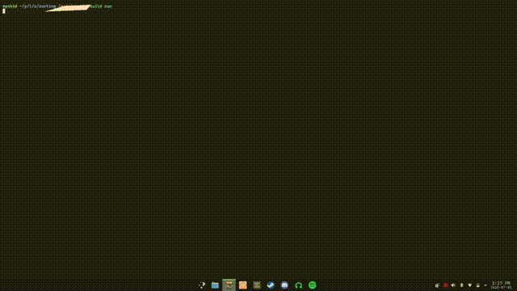

# zorting
you know those sorting algorithm visualizations on youtube? this is just that but worse.

<details>
<summary>demo (compressed into oblivion)</summary>

</details>

## the code
```c
// TODO: fix the code
```
it's kind of mess. all the algorithms (even the recursive ones) had to be reduced to a step function.
this means manual control flow and a manual "call stack". it gets ugly.
